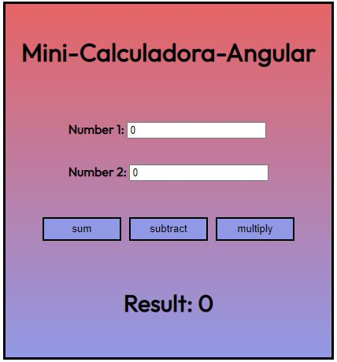

# Mini-Calculadora-Angular

## Table of contents

- [Overview](#overview)
  - [Screenshot](#screenshot)
  - [Built with](#built-with)
- [Author](#author)

## Overview

This is a very simple calculator, where you can sum, subtract and multiply two numbers.

Link to the app: https://lucent-torte-a73881.netlify.app/

### Screenshot

### Built with

- Angular
- CSS custom properties
- Flexbox
- CSS Grid
- TypeScript

## Author

- TikTok - [@elrincondeldev](https://www.tiktok.com/@elrincondeldev)
- Instagram - [@elrincondeldev](https://www.instagram.com/elrincondeldev/)
